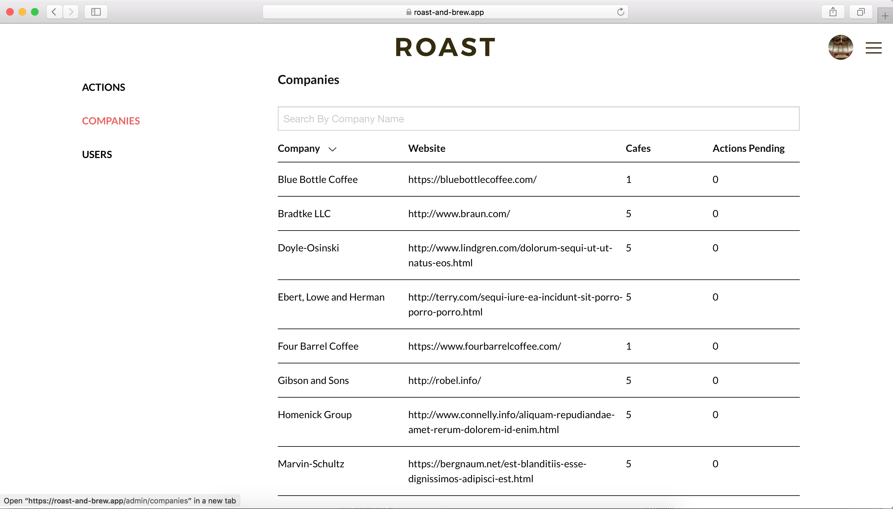

# Roast

Overview
--------
Roast is a coffee shop finder web app that helps in locating local coffee roasters and shops with the help of Google Maps included. It’s pretty simple, we will have a few entities such as users, coffee shops, tags, etc. A live version is hosted at `http://roast.tunjiafolabi.com`. However, a local setup can be achieved by following the installation steps below.
Currently, the authentication is implemeted via OAuth i.e `Login with Google` and `Login with Facebook`. Traditional email registration and login will be implemented later.

The app consists of a restricted section accessible to only an admin - an admin menu link shows on the sidebar when an admin is logged in. The admin can approve a new cafe added by regular users. Users and Companies are also managed by an admin.

### Users
There are two kinds of users:
- Regular user
- Admin user

Requirements
------------
- Laravel 5.7
- Laravel Passport
- Laravel Socialite
- VueJs
- Zurb Foundation

Installation:
-------------
### Backend Setup
- Clone the project: ```git clone https://github.com/atunjeafolabi/roast-and-brew.git```
- Create a mysql database named ```roast-and-brew```
- Rename ```.env.example``` to ```.env``` and fill it with the database credentials (username and password). New App need to be created on Google and also Facebook developer section to enable the OAuth Login. (If you need test credentials to put in the `.env` file, kindly contact me) 
- From the project root directory, run `composer install`
- Run migrations ```php artisan migrate```
- Generate some dummy data ```php artisan db:seed```
- Generate App Key with `php artisan key:generate`
- Start local dev server: ```php artisan serve --port=5000``` 
- Run Seeders?
### Frontend Setup
- Run `npm install`
- Then run `npm run dev`

Usage
----
Visit the local homepage at `localhost:5000`

### Screenshots
##### Home Page

##### Show all Cafes on map


##### List of all Cafes


##### Add Cafe


##### Edit Cafe


##### Link to Admin section


##### Admin - Approve/Deny Actions


##### Admin - Manage Companies


Running Test:
------------
- Create a mysql database named ```roast-and-brew-test``` and enter the database details in the `.env.testing` file
- Run ```composer test```

Future Works
------------
- To add traditional user resgistration and login via email and password
- Connect to an external coffee shop api service to always get up to date list of coffee shops.

Issues
------
- If you face any difficulty in setting this project up locally or have other issues, kindly create a github [Issue](https://github.com/atunjeafolabi/roast-and-brew/issues).
